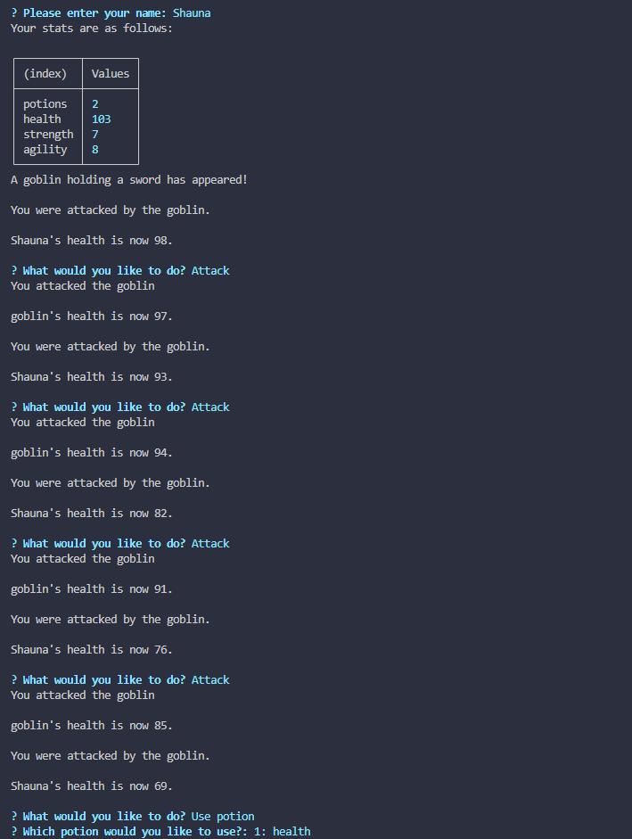
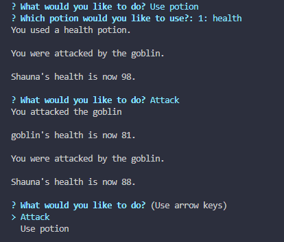

# Jest Another RPG

## Description

Jest Another RPG is a command-line role-playing game where users can create a character, battle enemies, and collect potions. The game is built using JavaScript and utilizes Node.js for execution. It also includes unit tests written with Jest to ensure code reliability.

## Features

- Create a custom character with a name that gets randomly generated attributes.
- Battle enemies and earn rewards.
- Collect potions to restore health or gain other benefits.
- Navigate through game options using arrow keys.

## Preview




## Installation

1. Clone the repository:

```bash
git clone https://github.com/SLachelier/jest-another-RPG.git
```

2. Navigate to the project directory:

```bash
cd jest-another-RPG
```

3. Install dependencies:

```bash
npm install
```

## Usage

1. Start the program in your terminal:

```bash
node app.js
```

2. Follow the on-screen prompts to:

- Create your character by entering a name.
- Use arrow keys to navigate between options during battles and other interactions.
- Select actions such as attacking, or using potions.

3. Progress through the game by defeating enemies and collecting rewards.

## Testing

Run the unit tests with Jest:

```bash
npm test
```

## Technologies Used

- Node.js
- Jest (for testing)
- Inquirer.js (for interactive prompts)

## License

This project is licensed under the MIT License.

## Contributing

Feel free to fork the repository and submit pull requests for improvements or new features.
